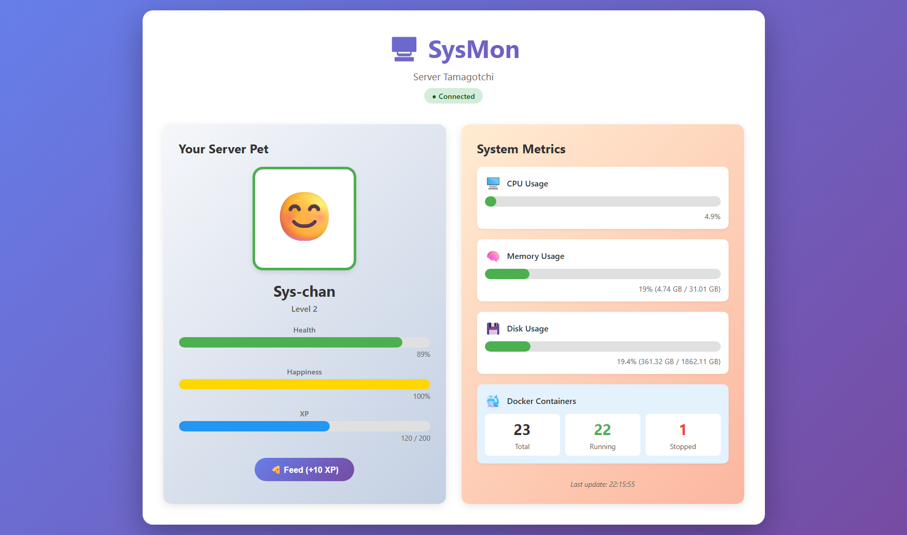

# SysMon - Server Tamagotchi 🖥️🐾


**SysMon** is a gamified server monitoring tool that visualizes your system health through a Tamagotchi-like creature. Instead of boring graphs, keep your server pet happy to ensure your system is running smoothly!



## Features

- 🎮 **Gamified Monitoring** - Server pet with levels, XP, and health based on system metrics.
- 📊 **Real-time Stats** - WebSocket updates every 2 seconds for CPU, RAM, disk, and Docker containers.
- 🐳 **Docker Integration** - Monitor container health via Docker SDK.
- 💾 **Persistent State** - SQLite database saves your Tamagotchi's progress and customization.
- 🎨 **Beautiful UI** - Gradient-rich Svelte frontend with responsive design and smooth animations.

## Quick Start (Docker Compose)

The easiest way to run SysMon is via Docker Compose.

```bash
# 1. Clone the repository
git clone https://github.com/PeterPage2115/SysMon.git
cd SysMon

# 2. Start the container
docker-compose up -d

# 3. Access the WebUI
# Open http://localhost:8000 in your browser
```

### Unraid & Custom Setup

For **Unraid** or custom Docker setups, make sure to map the necessary volumes to get accurate host metrics.

The included `docker-compose.yml` is pre-configured with:
- `pid: host` (Required for real host CPU/RAM metrics)
- `/var/run/docker.sock` (Required for container monitoring)
- `/mnt/user` (Example path for disk monitoring)

**Unraid Users:** Simply run `docker-compose up -d` and access `http://YOUR-UNRAID-IP:8001`.

## Configuration

You can configure the application using environment variables in your `docker-compose.yml`:

| Variable | Default | Description |
|----------|---------|-------------|
| `DISK_PATH` | `/` | The file system path to monitor for disk usage info. **Unraid users:** set this to `/mnt/user`. |
| `PORT` | `8000` | The internal port the application listens on. |

## How It Works

Your Tamagotchi's mood is a direct reflection of your server's health:

| Mood | Condition | Resource Usage |
|------|-----------|----------------|
| 😊 **Happy** | Healthy | Low usage (< 50%) |
| 😐 **Neutral** | Okay | Moderate usage (50-80%) |
| 😰 **Stressed** | Warning | High usage (80-95%) |
| 🤒 **Critical** | Critical | Overloaded (> 95%) |

**Gameplay:** Feed your pet to gain XP! Higher levels unlock... bragging rights (for now).

## API Endpoints

SysMon provides a REST API for integrations:

| Endpoint | Method | Description |
|----------|--------|-------------|
| `/api/health` | `GET` | Health check with version info |
| `/api/stats` | `GET` | Current system statistics (CPU, RAM, Disk, Docker) |
| `/api/tamagotchi` | `GET` | Current Tamagotchi state (Level, XP, Mood) |
| `/api/tamagotchi/rename?name=X` | `POST` | Rename your pet |
| `/api/tamagotchi/feed` | `POST` | Feed your pet (+10 XP) |
| `/ws` | `WS` | WebSocket for real-time updates |

## Roadmap

Future plans for SysMon:
- [ ] 🔔 Notifications (Discord/Telegram) when the pet gets "sick" (high load).
- [ ] 📈 Historical graphs for CPU/RAM usage.
- [ ] 🎩 More customization (skins/themes for the pet).
- [ ] 🖥️ Multi-server support (Agent mode).

## Tech Stack

- **Backend**: Python 3.11, FastAPI, WebSockets, psutil, Docker SDK
- **Frontend**: Svelte 4, Vite, TypeScript
- **Database**: SQLite (SQLModel)
- **Deployment**: Docker (multi-stage build)

## Local Development

If you want to contribute or modify the code:

```bash
# 1. Backend Setup
cd backend
pip install -r requirements.txt
uvicorn app.main:app --reload

# 2. Frontend Setup
cd frontend
npm install
npm run dev
```

## License

Distributed under the MIT License. See `LICENSE` for more information.

## Contributing

Contributions are what make the open source community such an amazing place to learn, inspire, and create. Any contributions you make are **greatly appreciated**.

1. Fork the Project
2. Create your Feature Branch (`git checkout -b feature/AmazingFeature`)
3. Commit your Changes (`git commit -m 'Add some AmazingFeature'`)
4. Push to the Branch (`git push origin feature/AmazingFeature`)
5. Open a Pull Request
```
